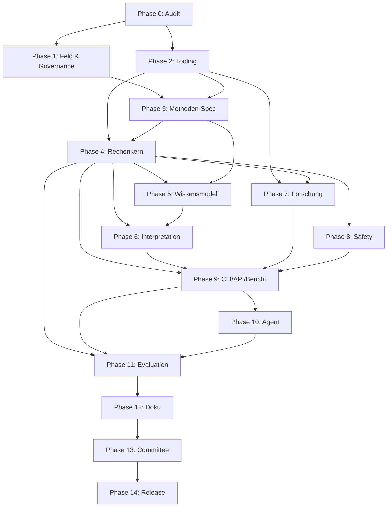

# Roadmap — Numerology Analyst Agent

> **Dokumenttyp:** Phasen-Roadmap (verbindlich)
> **Quelle der Wahrheit:** Master-Vertrag `docs/governance/master-implementation-contract.md` (externer Master-Prompt, intern importiert), Section 7 (Phasen 0–14), Section 4 (Tech-Stack)
> **Stand:** 2026-07-25 (V1.1 — Lukes Review vom 2026-07-25 eingearbeitet)
> **Sprache:** Deutsch
> **Status:** Phase 0 IN PROGRESS — Planartefakte V1.1 erstellt, Repository-Baseline und Implementierung 0.1.0 ausstehend

Diese Roadmap übersetzt die **15 Phasen (0–14)** des Master-Vertrags in eine
strukturierte, nachvollziehbare Abfolge. Pro Phase: Ziel, Aufgaben, Gate,
Commit-Message, Abhängigkeiten, Aufwandsschätzung, Delegations-Empfehlung, Risiken.

**Aufwandsskala (konservativ, in Arbeitstagen einer Person):**

- **S** = 0,5–1 Tag
- **M** = 2–4 Tage
- **L** = 5–9 Tage
- **XL** = 10+ Tage (mehrtägig, mehrere Sub-Wellen)

**Annahmen für alle Schätzungen:**

- 1 erfahrene Person (Senior Python Engineer) als Driver.
- Subagenten parallelisieren, aber Review/Integration bleibt beim Driver.
- **Parallelisierungsregeln (V1.1):**
  - Parallele Arbeit erlaubt, wenn keine direkte Daten-/Schema-/Codeabhängigkeit besteht.
  - Maximal 3 aktive Streams gleichzeitig (CLAUDE.md §2).
  - Gemeinsames Integrationsgate (CI + Milestone-Review am Ende jedes Releases).
  - Konkrete Parallelen und vollständige Dependency Graph siehe `docs/audit/implementation-plan.md`.
- Keine Surprise-Requirements aus Stakeholdern außerhalb des Master-Vertrags.

---

## Release-Strategie (V1.1)

> **Lukes Architekturentscheidung (2026-07-25):** Die Roadmap wird in zwei
> Ebenen geteilt — eine langfristige **North-Star-Roadmap** (alle 15 Phasen,
> die komplette Plattformvision) und eine operative **Release-Roadmap**
> (kurzfristige, lieferbare Releases).

### North-Star-Roadmap (dieses Dokument)

- Alle **15 Phasen (0–14)** — die komplette Plattformvision.
- Verbindlich für das Endprodukt V1.
- Lücken bleiben für North-Star relevant (siehe `docs/audit/gap-analysis.md`).

### Operative Release-Roadmap

| Release | Titel | Phasen | Ziel | Zeitrahmen |
|----------|-------|--------|------|------------|
| **0.1.0** | Deterministic Core | 0–4 | Governance + Tooling + Methodenspec + Rechenkern + CLI-Basis + Tests | ~2–4 Wochen |
| **0.2.0** | Knowledge and Interpretation | 5–6 | Wissensmodell + regelbasierte Interpretation | später |
| **0.3.0** | Interfaces and Agent | 8, 9, 10 | Safety + Core CLI/API (ohne Forschung) + Mock-Provider + Agent-Adapter | später |
| **0.4.0** | Research Preview | 7 | Forschungs-/Meta-Analyse-Rahmen — **explizit als Preview, nicht als wissenschaftliche Validierung** | später |

**Phasen 11–14** (Evaluation, Doku, Committee, Release) werden in die
jeweiligen Releases eingebettet, sie sind **kein eigener Release**.

→ Details zu 0.1.0 siehe `docs/v1-minimal-scope.md` (Vorgabe Luke).

### Warum die Trennung

- **0.1.0** fokussiert auf den deterministischen Kern ohne Forschungsrattenschwanz.
  `POST /v1/calculate/profile` braucht keinen Forschungsrahmen.
- **0.4.0** (Research Preview) ist explizit als Vorschau markiert, nicht als
  wissenschaftliche Validierung — das verhindert überzogene Claims.
- **0.3.0** entkoppelt Core CLI/API von der Forschung (Lukes Korrektur #6).

---

## Phasenübersicht (Tabelle)

| Phase | Titel | Aufwand | Release | Abhängt von | Blockiert |
|-------|-------|---------|---------|-------------|-----------|
| 0 | Reality Check & Baseline | S | 0.1.0 | — | 1–14 |
| 1 | Felddefinition & Governance | M | 0.1.0 | 0 | 3, 5, 6, 8, 13 |
| 2 | Repository- & Tooling-Fundament | L | 0.1.0 | 0 | 4, 9, 11, 14 |
| 3 | Kanonische pythagoreische Spezifikation | L | 0.1.0 | 1 | 4, 5 |
| 4 | Deterministischer Rechenkern | XL | 0.1.0 | 2, 3 | 5, 6, 9 (Core), 10, 11 |
| 5 | Wissensmodell & Content Packs | L | 0.2.0 | 3, 4 | 6 |
| 6 | Interpretations- & Analysemodell | L | 0.2.0 | 4, 5 | 9 (Core), 10 |
| 7 | Forschungs- & Meta-Analyse-Rahmen | L | 0.4.0 (Preview) | 2, 4 | 9 (Research-Endpunkt), 13 |
| 8 | Safety, Ethik & Datenschutz | L | 0.3.0 | 4 | 9, 10, 13 |
| 9 | CLI, API & Berichte | L | 0.3.0 | Core: 4+Schemas+8 · Research: 7 | 10, 11 |
| 10 | Agentenschicht | M | 0.3.0 | 9 | 11 |
| 11 | Evaluation & Qualitätsgates | L | eingebettet | 4, 9, 10 | 12, 13, 14 |
| 12 | Dokumentation & Beispiele | M | eingebettet | 11 | 13, 14 |
| 13 | Committee Review | M | eingebettet | 12 | 14 |
| 14 | GitHub-Finalisierung & Release | M | eingebettet | 13 | — |

> **Hinweis zur Phasen-9-Entkopplung (V1.1, Lukes Korrektur #6):** Phase 9
> zerfällt in zwei Stränge — die **Core CLI/API** (abhängig von Phase 4 +
> Basis-Schemas + Phase 8, *nicht* von Phase 7) und den **Research-Endpunkt
> `/v1/research/smoke`** (abhängig von Phase 7). Grund: `POST /v1/calculate/profile`
> braucht keinen Forschungsrahmen.

**Geschätzte Gesamtsumme (ohne Puffer):** ca. 56–65 Arbeitstage.
**Mit 20 % Puffer (Standard-Projekt-Risiko):** ca. 67–78 Tage ≈ 14–16 Wochen.

---

## Phase 0 — Reality Check und Baseline

**Status:** IN PROGRESS — Planartefakte V1.1 erstellt (`PROJECT_CHARTER.md`,
`ROADMAP.md`, `docs/audit/gap-analysis.md`, `docs/audit/implementation-plan.md`,
`.planning/notes/master-plan-defaults.md`). Repository-Baseline
(`docs/audit/repository-baseline.md`) und Initial-Commit auf Implementierungs-
branch stehen noch aus.

**Ziel:** Verifizierter Ist-Zustand, dokumentierte Baseline, klarer Scope für alle Folgemonate.

**Aufgaben:**
- Repository-Zustand inventarisieren.
- Vorhandene Inhalte sichern.
- Aktuelle Architektur bewerten.
- Gap-Analyse erstellen.
- Arbeitsbranch anlegen.
- Baseline-Commit identifizieren.

**Dateien (Master-Vertrag):**
- `docs/audit/repository-baseline.md` *(ausstehend)*
- `docs/audit/gap-analysis.md` ✅ V1.1
- `docs/audit/implementation-plan.md` ✅ V1.1

**Gate:**
- Keine uncommitted Änderungen verloren.
- Remote und Branch dokumentiert.
- Tatsächlicher Dateibestand nachvollziehbar.

**Commit-Message:**
`chore: audit repository baseline and define implementation scope`

**Abhängigkeiten:** keine (Start-Phase).

**Aufwand:** **S** (0,5–1 Tag). Großteil der Arbeit: dieser Plan ist bereits
Teil von Phase 0 (Master-Prompt verlangt `docs/audit/*` — 3 dieser Dateien
werden in dieser Plan-Session geliefert; `repository-baseline.md` fehlt noch
und ist Teil der Phase-0-Implementierung).

**Delegations-Empfehlung:** `godlike-code-master` (Verifikation + Doku). Keine
parallelen Subagenten nötig.

**Risiken:**
- *Hallucination der Vorgängersession:* Memory warnt, dass vorherige Session
  51 Dateien behauptet hat, die nicht existieren. → Verifikation mit `dir` +
  `git log` zwingend, siehe Session-Memory `numerology-agent-real-state.md`.
- *Falsche Baseline:* Wenn Baseline-Commit nicht korrekt dokumentiert, sind
  alle Folgemaße nicht reproduzierbar.

---

## Phase 1 — Felddefinition und Governance

**Ziel:** Fachgebiet formal abgrenzen, Claim-Taxonomie, Evidenzgrade, Governance und ADR-System etablieren.

**Aufgaben:**
- Fachgebiet abgrenzen.
- Claim-Taxonomie definieren (6 Aussageklassen, siehe PROJECT_CHARTER §3).
- Evidenzgrade definieren.
- Wissenschaftliche Positionierung schreiben.
- Governance- und Committee-Modell erstellen.
- ADR-System einführen.

**Gate:**
- Symbolische Tradition, Interpretation und Evidenz sind sauber getrennt.
- Scope und Nicht-Ziele sind eindeutig.
- Jede künftige Methodenänderung besitzt einen Reviewprozess.

**Commit-Message:**
`docs: establish field charter governance and evidence model`

**Abhängigkeiten:** Phase 0.

**Aufwand:** **M** (2–4 Tage). Viel Fachtext, Claim-Taxonomie muss präzise,
Evidenzgrade konsistent. Governance braucht ADR-Template.

**Delegations-Empfehlung:**
- Hauptarbeit: `content-creator` (Fachtext + ADR-Templates).
- Review: `gsd-planner` für Governance/Review-Prozess.

**Risiken:**
- *Claim-Taxonomie zu schwammig:* Wenn die 6 Aussageklassen nicht scharf
  genug definiert sind, fallen Phasen 5/6 durch die Gates. → Vorab
  Akzeptanzkriterien für jede Klasse definieren.
- *Governance ohne Zähne:* Committee-Modell ohne echte Veto-Rechte ist
  Placebo. → ADR `0001-architecture.md` muss Phase-13-Blockade dokumentieren.

---

## Phase 2 — Repository- und Tooling-Fundament

**Ziel:** Reproduzierbares Python-Projekt mit allen Tools, CI-Basis, Paketstruktur und MkDocs.

**Aufgaben:**
- `pyproject.toml` mit reproduzierbaren Abhängigkeiten.
- `uv.lock`.
- Ruff, Mypy, Pytest, Hypothesis und Coverage.
- Pre-Commit.
- Makefile-Befehle.
- CI-Basis.
- Paketstruktur (alle `__init__.py`, leer, klar markiert als Placeholder).
- MkDocs.

**Pflichtbefehle (alle müssen grün sein):**
```bash
uv sync --all-groups
uv run ruff format --check .
uv run ruff check .
uv run mypy src apps
uv run pytest
uv run mkdocs build --strict
```

**Gate:**
- Alle Befehle erfolgreich.
- Keine zyklischen Imports.
- Frischer Checkout reproduzierbar.

**Commit-Message:**
`build: establish reproducible python tooling and package boundaries`

**Abhängigkeiten:** Phase 0.

**Aufwand:** **L** (5–9 Tage). Toolchain-Konfiguration, Pre-Commit-Hooks,
GitHub-Actions-Workflows (ci, security, docs, release), MkDocs-Material-Setup.

**Delegations-Empfehlung:**
- Hauptarbeit: `devops-automator` (Toolchain, CI, pre-commit).
- Review: `godlike-code-master` für Paketstruktur / Abhängigkeitsregeln.

**Risiken:**
- *Zyklische Imports zwischen Paketen:* Wenn Paketgrenzen nicht klar, bricht
  Phase 4. → Schon hier ADR für Dependency-Rules (`docs/architecture/dependency-rules.md`).
- *Mypy strict schlägt spät fehl:* Strict-Mode in Phase 2 setzen, nicht in
  Phase 4. Sonst technische Schulden.
- *CI zu langsam / flaky:* Wenn CI-Basis instabil, werden alle Folgephase blockiert.
- *Pinned versions:* Ohne `uv.lock` ist nichts reproduzierbar — Phase 14
  (Release) fällt durch.

---

## Phase 3 — Kanonische pythagoreische Spezifikation

**Ziel:** Vollständige, versionierte Methodenspezifikation `pythagorean-v1` mit Pseudocode, Verträgen und Testfällen für jeden Algorithmus.

**Aufgaben:**
- Exakte Buchstabenbelegung.
- Unicode- und Locale-Normalisierung.
- Meisterzahlen und Reduktion.
- Y-Regel als Policy.
- Datumsalgorithmen.
- Lebensweg-Methoden A und B.
- Namenszahlen.
- Zyklusregeln.
- Rechenbeispiele.
- Methodenversion `pythagorean-v1`.

**Gate:**
- **Keine Interpretationen in dieser Phase.**
- Jeder Algorithmus besitzt Pseudocode, Vertrag und Testfälle.
- Streitige Varianten sind dokumentiert und nicht still vermischt.

**Commit-Message:**
`docs: define canonical pythagorean method version one`

**Abhängigkeiten:** Phase 1 (Claim-Taxonomie als Frame für Methodenbegriffe).

**Aufwand:** **L** (5–9 Tage). Präzise Spezifikation mit Rechenbeispielen.

**Delegations-Empfehlung:** `content-creator` (Methodenspezifikation) +
`godlike-code-master` (Vertragstests/Golden-Cases-Definitionen).

**Risiken:**
- *OFFEN-Punkte aus PROJECT_CHARTER §6 müssen gelöst werden:*
  - **OFFEN-1:** Y-Regel (Vokal vs. Konsonant je nach Kontext).
  - **OFFEN-2:** Umlaut-Normalisierung (ä → a+e oder direkt).
  - **OFFEN-3:** Akzente (é, ñ).
  - **OFFEN-4:** Mehrfachnamen / Bindestriche.
  - **OFFEN-5:** Geburtsname vs. aktueller Name als Policy-Feld.
  → Diese Entscheidungen sind **Gate-Bedingung** für Phase 3. **Nicht erfinden.**
- *Stille Systemvermischung:* Wenn chaldäische Buchstabenwerte einfließen
  (z.B. aus "allgemein bekannten" Tabellen), ist die kanonische Methode
  verunreinigt. → Nur Quellen mit pythagoreischer Zuordnung verwenden, mit
  Quellenstatus `tradition_unverified`.
- *Varianten verschwiegen:* Methoden A vs. B (Lebensweg) müssen beide
  dokumentiert sein; nicht still eine Default wählen.

---

## Phase 4 — Deterministischer Rechenkern

**Ziel:** Funktionsfähiger, auditierbarer Rechenkern, der identische Eingabe+Policy byte-stabil reproduziert.

**Aufgaben:**
- Normalisierung.
- Alphabet-Mapping.
- Reduktion.
- Datumsberechnung.
- Namensberechnung.
- Konsistenzprüfung: Ausdrucks-Rohsumme = Vokalsumme + Konsonantensumme.
- Zyklusberechnung.
- Audit-Trace.
- Service-Fassade.

**Tests:**
- Unit-Tests.
- Golden Cases.
- Property-Based Tests (hypothesis).
- Locale- und Unicode-Fälle.
- Leap-Year- und Datumsvalidierung.
- Namen mit Akzenten, Bindestrichen und Umlauten.
- Mehrdeutige Y-Fälle.

**Gate:**
- **Core-Coverage mindestens 95 %.**
- Golden Cases vollständig grün.
- Identische Eingabe und Policy erzeugen **byte-stabile** strukturierte Ergebnisse.
- **Kein Netzwerk- oder LLM-Zugriff.**

**Commit-Message:**
`feat: implement deterministic pythagorean calculation engine`

**Abhängigkeiten:** Phase 2 (Tooling) + Phase 3 (Spezifikation).

**Aufwand:** **XL** (10–15 Tage). Größte Einzelphase. Property-Based Tests
sind teuer in der Ausarbeitung.

**Delegations-Empfehlung:**
- Hauptarbeit: `godlike-code-master` (Engine, Trace, Service).
- Parallel: `qa-tester` (Testsuiten, Golden Cases, hypothesis-Strategien).
- Review: `performance-benchmarker` (Byte-Stabilität, deterministische Hashes).

**Risiken:**
- *Byte-Stabilität bricht:* Wenn Dikt-Reihenfolge oder Hash nicht deterministisch,
  fallen Phase 9/11. → Trace in Phase 4 sofort pydantic-strict + sortierte Keys.
- *Coverage 95 % nicht erreicht:* Rechenkern ist die kritischste Phase; Gate
  blockiert sonst alle Folgemonate. → Schon hier Property-Based Tests für
  Invarianten (Reduktion idempotenz, Vokal+Konsonant=Expression).
- *LLM/Netzwerk-Leck:* Wenn ein Helper aus Versehen `requests` importiert,
  bricht Determinismus. → No-Network-Test als Pflicht in Phase 4.
- *OFFEN-Punkte aus Phase 3 ungelöst:* Wenn Phase 3 noch Fragen offen ließ,
  bricht Phase 4 an diesen Stellen. → Phase-3-Gate strikt halten.

---

## Phase 5 — Wissensmodell und Content Packs

**Ziel:** Versioniertes Wissensmodell mit schema-validierten YAML-Packs, klarer Quellenstatus-Trennung, Gegenhypothesen.

**Aufgaben:**
- Schema für Wissenseinträge (knowledge-entry.schema.json).
- Manifest und Versionierung.
- Deutsche Pythagoreische Wissensbasis (numbers-1-9, master-numbers,
  compound-numbers, karmic-debts, cycles, relationships).
- Quellenstatus und Traditionszuordnung.
- Gegenhypothesen.
- Qualitätsprüfung gegen Duplikate und widersprüchliche IDs.
- Trennung von Grundbedeutung, Schatten, Entwicklung und Kontext.

**Gate:**
- Alle YAML-/JSON-Dateien schema-validiert.
- Keine unklassifizierten absoluten Aussagen.
- Jeder Inhalt besitzt stabile ID und Version.
- Der Rechenkern enthält **keine** Deutungstexte.

**Commit-Message:**
`feat: add versioned numerology knowledge model and german content pack`

**Abhängigkeiten:** Phase 3 (Methodenversion) + Phase 4 (Rechenkern getrennt von Wissen).

**Aufwand:** **L** (5–9 Tage). Sehr viel Text + Schema-Validierung.

**Delegations-Empfehlung:**
- Hauptarbeit: `content-creator` (Wissensbasis-Texte).
- Review: `godlike-code-master` (Schema-Validator, ID-Stabilität).

**Risiken:**
- *KI-generierter Draft als Wahrheit verkauft:* Default #4 erlaubt
  KI-generierten ersten Draft, aber nur als `traditional_claim` mit
  `quellenstatus: tradition_unverified`. Wenn diese Markierung fehlt, ist das
  Gate verletzt.
- *Widersprüchliche IDs:* Wenn zwei Entries dieselbe ID haben, bricht die
  Phase-5-Validierung. → Validator mit Duplikat-Check in `scripts/validate_knowledge.py`.
- *Deutung im Rechenkern:* Wenn Texte aus Versehen in `numerology_engine`
  landen, bricht die Schichtentrennung. → Phasen-Gate prüft explizit.
- *Autorschaft unsichtbar:* Wenn KI-Autorschaft nicht markiert, ethisch
  problematisch. → Manifest muss `generated: true` + Datum + Model setzen.

---

## Phase 6 — Interpretations- und Analysemodell

**Ziel:** Regelbasierte Interpretationskomposition, rückverfolgbar auf Rechenkern und Wissensmodell.

**Aufgaben:**
- Regelbasierte Komposition.
- Prioritätenhierarchie.
- Spannungs- und Regulationsmodell.
- Gegenhypothesen.
- Aussageklassen.
- Einzelprofil.
- Beziehungsanalyse.
- Eltern-Kind-Modus mit Schutzgrenzen.
- Entwicklungsroadmap.
- **keine freie LLM-Erfindung als Kernfunktion.**

**Gate:**
- Jede Aussage ist auf Berechnungsdaten und Wissenseinträge rückverfolgbar.
- Keine Diagnose.
- Keine garantierte Zukunft.
- Minderjährige erhalten keine starre Identitätszuschreibung.
- Wiederholungen werden dedupliziert.

**Commit-Message:**
`feat: implement traceable interpretation and profile composition`

**Abhängigkeiten:** Phase 4 (Rechenkern) + Phase 5 (Wissensmodell).

**Aufwand:** **L** (5–9 Tage). Kompositionsregeln, Spannungsmodell, Eltern-Kind-Modus.

**Delegations-Empfehlung:** `godlike-code-master` (Kompositionslogik) +
`content-creator` (Interpretationstexte).

**Risiken:**
- *Diagnose-Sprache durchsickern:* Wenn Texte aus Phase 5 diagnostisch sind
  ("Du bist depressiv"), verstößt es gegen §2.3. → Claims-Validator prüft
  Blacklist-Wörter.
- *Identitätszuschreibung bei Minderjährigen:* Gegen §2.3 + Phase 8 Safety.
  → Eltern-Kind-Modus mit Filter.
- *LLM als Kernfunktion:* Wenn freie Generierung als Fallback eingebaut wird,
  bricht Determinismus-vor-LLM (§2.4). → Kernfunktion MUSS regelbasiert sein.

---

## Phase 7 — Forschungs- und Meta-Analyse-Rahmen

**Ziel:** Reproduzierbarer Forschungsrahmen mit Hypothesenregister, Nullmodellen, Permutation, Smoke-Test.

**Aufgaben:**
- Hypothesenregister.
- Präregistrierungsformat.
- Datenprovenienz.
- Beispieldatensatz (synthetisch — Default #3).
- Feature Engineering.
- Nullmodelle und Permutation.
- Effektstärken und Konfidenzintervalle.
- Multiple-Testing-Korrektur.
- Confounder-Dokumentation.
- reproduzierbarer Smoke-Test.
- Ergebnisbericht mit expliziter Negativresultat-Option.

**Gate:**
- Forschungscode darf keine symbolischen Deutungstexte als Labels verwenden,
  sofern diese nicht vorher formal operationalisiert wurden.
- Explorative und konfirmatorische Analysen sind getrennt.
- Seed und Softwareversionen werden gespeichert.
- Ein kompletter Smoke-Run funktioniert **offline** mit Sample-Daten.

**Commit-Message:**
`feat: establish reproducible numerology research and null-model framework`

**Abhängigkeiten:** Phase 2 (Tooling: DuckDB, Polars) + Phase 4 (Features aus Rechenkern).

**Aufwand:** **L** (5–9 Tage). Statistik ist kritisch; Nullmodelle teuer.

**Delegations-Empfehlung:**
- Hauptarbeit: `godlike-code-master` (Pipelines, Statistik).
- Review: `performance-benchmarker` (Reproduzierbarkeit, Seed-Stabilität).

**Risiken:**
- *Deutung als Label:* Forschungscode darf nicht pythagoreische
  Begriffe als Label benutzen, ohne sie vorher zu operationalisieren.
  → Expliziter Review-Schritt.
- *P-Hacking-Risiko:* Multiple-Testing ohne Korrektur → False Positives.
  → Bonferroni/BH verpflichtend in Phase 7.
- *PII-Leak:* Wenn Biografien (Default #3 optional) als echte Personen
  in Git landen. → Nur synthetische Daten in V1, öffentliche Biografien
  optional später, aber PII-Test in Phase 8.
- *Smoke-Test offline nicht möglich:* Wenn Permutation Internet braucht,
  bricht das Gate. → DuckDB lokal, keine externen API-Calls.

---

## Phase 8 — Safety, Ethik und Datenschutz

**Ziel:** Technisch durchgesetzter Datenschutz, Minderjährigenschutz, Krisenunterbrechung, Claims-Validierung.

**Aufgaben:**
- Datenschutzmodell.
- Minderjährigenschutz.
- Krisenunterbrechung.
- PII-Regeln.
- Consent- und Datenquellenmodell.
- Claims-Validator.
- Prompt-Extraktionsschutz.
- Threat Model.
- **keine privaten Rohdaten im Repository.**

**Gate:**
- Secret Scan grün.
- PII-Testfälle vorhanden.
- Krisenfälle unterbrechen Deutungen.
- Minderjährigenfälle werden begrenzt.
- API protokolliert keine sensiblen Rohdaten standardmäßig.

**Commit-Message:**
`feat: enforce privacy safety and responsible claim boundaries`

**Abhängigkeiten:** Phase 4 (Rechenkern, auf dem Safety aufsetzt).

**Aufwand:** **L** (5–9 Tage). Safety-Tests, Threat Model, Claims-Validator.

**Delegations-Empfehlung:** `godlike-code-master` (Safety-Logik) +
`qa-tester` (Safety-Test-Suite).

**Risiken:**
- *PII im Repo:* Wenn Synth-Daten zu realistisch, oder echte Biografien
  (Default #3) als PII erkannt werden. → PII-Scanner pre-commit.
- *Krise nicht erkannt:* Wenn bei destruktiven Eingaben (z.B. Suizid-Andeutung)
  die Interpretation weiterläuft, ethisch kritisch. → Krise muss
  Soft-Underflow triggern + klare Hinweismeldung.
- *Secret-Scan umgangen:* Wenn Third-Party-Action ohne Pin → Supply-Chain-Risiko.

---

## Phase 9 — CLI, API und Berichte

**Ziel:** Funktionsfähige CLI und REST-API, OpenAPI-Schema, Markdown-Berichte, Beispieldateien.

**CLI-Befehle:**
```text
numerology methods list
numerology calculate profile
numerology calculate cycles
numerology analyze profile
numerology compare profiles
numerology validate knowledge
numerology research smoke
```

**API-Endpunkte:**
```text
GET  /health
GET  /v1/methods
POST /v1/calculate/profile
POST /v1/calculate/cycles
POST /v1/interpret/profile
POST /v1/compare
POST /v1/research/smoke
```

**Aufgaben:**
- Strukturierte JSON-Ausgabe.
- OpenAPI-Schema (reproduzierbar).
- Fehlercodes.
- Request IDs.
- Keine stillen Defaults.
- Markdown-Bericht.
- maschinenlesbarer Bericht.
- Beispieldateien.

**Gate:**
- API-Integrationstests grün.
- CLI-Smoke-Test grün.
- OpenAPI-Datei reproduzierbar.
- Fehler bei ungültigen Daten sind klar und stabil.

**Commit-Message:**
`feat: expose validated calculation research and reporting interfaces`

**Abhängigkeiten (V1.1 — entkoppelt, Lukes Korrektur #6):**

Phase 9 zerfällt in zwei Stränge mit separaten Abhängigkeiten:

- **Core CLI/API** (`numerology calculate profile`, `POST /v1/calculate/profile`,
  `/v1/methods`, `/v1/interpret/profile` ohne Forschungsteil):
  abhängig von **Phase 4** (Engine) + **Basis-Schemas** (Phase 1/3) + **Phase 8** (Safety).
  → Diese Endpunkte brauchen **keinen** Forschungsrahmen und kommen in Release 0.3.0.
- **Research-Endpunkt** (`POST /v1/research/smoke`, `numerology research smoke`):
  abhängig von **Phase 7** (Research-Modul).
  → Kommt frühestens mit Release 0.4.0 (Research Preview).

**Aufwand:** **L** (5–9 Tage). API + CLI + Bericht + Beispiele. Core-Strang
ist die Hauptarbeit in 0.3.0; Research-Endpunkt ist附加lich in 0.4.0.

**Delegations-Empfehlung:**
- Hauptarbeit (Core): `domain-architect` + `calculation-engineer` (siehe `.github/agents/`).
- Research-Endpunkt: `calculation-engineer` (abhängig von Phase 7).
- Review (OpenAPI-Reproduzierbarkeit, CI): `release-engineer` (siehe `.github/agents/`).

**Risiken:**
- *Stille Defaults:* Wenn Endpunkt ohne explizite Policy-Parameter Defaults
  setzt, bricht §6.2 (Methodenkonfiguration). → Jede Berechnung braucht
  Policy-Feld; Default-Config muss dokumentiert und kanonisch sein.
- *OpenAPI nicht deterministisch:* Wenn Reihenfolge von Modellen variiert,
  fällt Reproduzierbarkeit. → Sortierte Felder, pydantic v2.
- *Request-ID-Leak:* Wenn Request-ID nicht propagiert wird, ist Audit-Trace
  in Produktion nutzlos.

---

## Phase 10 — Agentenschicht

**Ziel:** Dünner LLM-Adapter über validierten Services; Plattform funktioniert ohne LLM; Mock-Provider in V1.

**Aufgaben:**
- Tools für Berechnung und Wissensabfrage.
- Strukturierten Kontext an das LLM übergeben.
- Promptdateien versionieren.
- LLM-Ausgabe gegen Claims- und Safety-Modell validieren.
- Systemprompt nicht als Quelle mathematischer Wahrheit verwenden.
- Provider-Abstraktion.
- **LLM optional machen.**
- **Mock-Provider für Tests.**

**Gate:**
- Plattform funktioniert **ohne LLM**.
- Agent kann keine Rechenergebnisse überschreiben.
- Tool-Ausgaben sind nachvollziehbar.
- Prompt-Evals für Halluzination, absolute Aussagen und Datenextraktion grün.

**Commit-Message:**
`feat: add optional llm analyst adapter over validated domain services`

**Abhängigkeiten:** Phase 9 (CLI/API als Tool-Targets).

**Aufwand:** **M** (2–4 Tage). Adapter ist dünn; Provider-Abstraktion +
Mock + Evals.

**Delegations-Empfehlung:** `godlike-code-master` (Adapter + Provider-Abstraktion).

**Risiken:**
- *Echter Provider in V1:* Default #5 verbietet echten Provider. Wenn er
  dennoch eingebaut wird, bricht Gate + Determinismus. → Mock-Only-Check.
- *LLM überschreibt Resultate:* Wenn Adapter dem LLM erlaubt, calc-Facts
  zu mutieren. → Read-Only-Vertrag für LLM-Output.
- *Prompt-Leak:* Wenn Systemprompt extrahierbar ist. → Phase 8 Prompt-Eval.

---

## Phase 11 — Evaluation und Qualitätsgates

**Ziel:** Vollständige Testmatrix, alle Qualitätsgates grün, keine TODOs in Release-Code.

**Testklassen:**
- Unit, Property, Golden, Integration, API, CLI, Schema, Knowledge, Research,
  Safety, Prompt-Evals, Regression.

**Qualitätsziele:**
- Core-Coverage ≥ 95 %.
- Gesamtabdeckung ≥ 85 %.
- Mypy strict grün.
- Ruff grün.
- Docs strict grün.
- Schema-Validierung grün.
- Security-Workflow grün.
- Reproduzierbarer Research-Smoke grün.
- Keine unaufgelösten `TODO` in Release-relevantem Code.
- Keine leeren Placeholder-Dateien.

**Commit-Message:**
`test: complete regression evaluation and release quality gates`

**Abhängigkeiten:** Phase 4 (Rechenkern-Tests) + Phase 9 (API/CLI-Tests) +
Phase 10 (Agent-Evals).

**Aufwand:** **L** (5–9 Tage). Test-Vervollständigung + Regression-Suite.

**Delegations-Empfehlung:** `qa-tester` (Hauptarbeit) + `godlike-code-master`
(Coverage-Lücken).

**Risiken:**
- *Coverage 95/85 nicht erreicht:* Wenn Phasen 4–10 Tests vernachlässigt haben.
  → Schon ab Phase 4 Coverage-Tracking.
- *Placeholder-Dateien als fake:* Master-Prompt verbietet "leere Attrappen als
  angeblich fertige Funktionalität". → Phase 11 muss leer-stehende Module
  identifizieren und als SPEC markieren oder implementieren.
- *TODOs blockieren Release:* → ruff-basierte TODO-Check in Phase 11.

---

## Phase 12 — Dokumentation und Beispiele

**Ziel:** Neue Entwickler können in frischem Checkout: installieren, testen, Profil berechnen, Bericht generieren, Research-Smoke starten.

**Aufgaben:**
- README auf Produkt- und Fachgebietsebene.
- Quickstart.
- Methodenhandbuch.
- API-Dokumentation.
- Forschungsleitfaden.
- Sicherheitsgrenzen.
- Beispielprofile.
- Beispielbeziehung.
- Beispiel-Forschungsbericht.
- Limitations.
- Beitragsleitfaden.

**Gate:**
Ein neuer Entwickler kann in einem frischen Checkout:
1. installieren,
2. Tests ausführen,
3. ein Profil berechnen,
4. einen Bericht generieren,
5. den Research-Smoke starten.

**Commit-Message:**
`docs: publish complete platform method and contributor documentation`

**Abhängigkeiten:** Phase 11 (alle Features stabil).

**Aufwand:** **M** (2–4 Tage). Viel Doku, aber die Fachtexte existieren
aus Phasen 1, 3, 5.

**Delegations-Empfehlung:** `content-creator` (Hauptarbeit) +
`godlike-code-master` (Beispiel-Skripte).

**Risiken:**
- *Doku veraltet:* Wenn nach Phase 12 noch Code-Änderungen, veraltet Doku.
  → Phase 12 MUSS nach Phase 11 stehen; Änderungen danach triggern Doku-Update.
- *Quickstart bricht:* Wenn Befehle nicht 1:1 matchen. → Quickstart-Befehle
  in CI als smoke-test ausführen.

---

## Phase 13 — Committee Review

**Ziel:** Multidisziplinäres Review aus 5 Perspektiven; alle kritischen Findings geschlossen.

**Review-Pack für fünf Perspektiven:**

1. **Engineering** — Architektur, Determinismus, Tests, Wartbarkeit.
2. **Numerologische Methodologie** — korrekte Spezifikation, dokumentierte
   Varianten, keine unbemerkte Systemvermischung.
3. **Statistik und Forschung** — Falsifizierbarkeit, Nullmodelle, Confounder,
   Reproduzierbarkeit.
4. **Safety und Privacy** — Minderjährige, Krisen, PII, Claims.
5. **Produkt und UX** — Verständlichkeit, Fehlerkommunikation,
   nachvollziehbare Berichte, keine Autoritätsillusion.

**Dateien:**
- `docs/committee/final-review.md`
- `docs/committee/findings.md`
- `docs/committee/release-decision.md`

**Gate:**
- Alle kritischen Findings geschlossen.
- Hohe Findings geschlossen oder formal akzeptiert.
- Freigabeentscheidung nachvollziehbar.

**Commit-Message:**
`docs: complete multidisciplinary committee review`

**Abhängigkeiten:** Phase 12 (Doku muss stehen für Review).

**Aufwand:** **M** (2–4 Tage). Review-Perspektiven brauchen Tiefgang.

**Delegations-Empfehlung:**
- 5 parallele Review-Perspektiven: `godlike-code-master` (Engineering),
  `content-creator` (Methodologie + Produkt/UX), `performance-benchmarker`
  (Statistik), `qa-tester` (Safety). Max. 3 parallel nach §2.
- Synthese: `gsd-planner`.

**Risiken:**
- *Self-Review-Bias:* Wenn derselbe Agent alle 5 Perspektiven schreibt,
  fehlt echte Kritik. → Verschiedene Subagenten, verschiedene Prompt-Settings.
- *Kritische Findings vertuscht:* Wenn nur "wenig" gefunden wird, ist das
  verdächtig. → Mindest-Foundings-Quote als Plausibilitäts-Check.
- *Freigabe ohne echte Prüfung:* `release-decision.md` ohne If/Then ist
  Placebo. → Klare Freigabe-/Blockade-Kriterien.

---

## Phase 14 — GitHub-Finalisierung und Release

**Ziel:** Version `0.1.0`, echter Pull Request, GitHub Release mit Tag und Notes.

**Aufgaben:**
- Finalen Branch aktualisieren.
- Gesamte Testmatrix ausführen.
- `git diff`, `git status` und Dateimanifest prüfen.
- Changelog.
- Version `0.1.0`.
- Draft Pull Request erstellen.
- CI abwarten.
- Branch Protection und Required Checks dokumentieren.
- Nach Freigabe mergen.
- GitHub Release mit Release Notes erstellen.

**Explizit NICHT erlaubt:**
- Direktes Pushen auf geschützten `main`.
- Force Push.
- Umgehen fehlgeschlagener Checks.
- Behauptung eines erfolgreichen Releases ohne Tag und GitHub-Release.
- Unkontrollierte Zusammenfassung aller Arbeiten in einem einzigen Commit.

**Empfohlene Commit-Reihenfolge** (Master-Prompt §7 Phase 14):
1. Audit, 2. Felddefinition, 3. Tooling, 4. Methodenspezifikation,
5. Rechenkern, 6. Wissensmodell, 7. Interpretation, 8. Forschung,
9. Safety, 10. Schnittstellen, 11. Agent, 12. Evaluation, 13. Doku,
14. Committee Review, 15. Release-Metadaten.

**Commit-Message:** nicht vom Master-Prompt vorgegeben.
**OFFEN-Vorschlag:** `release: version 0.1.0 of numerology analyst agent v1`
*(muss von Luke bestätigt werden, da Master-Prompt hier schweigt).*

**Abhängigkeiten:** Phase 13 (Committee-Freigabe).

**Aufwand:** **M** (2–4 Tage). PR, CI-Debugging, Release-Metadaten.

**Delegations-Empfehlung:** `devops-automator` (CI, Branch Protection, Release).

**Risiken:**
- *Merge vor Committee-Freigabe:* Wenn PR gemerged wird, bevor
  `release-decision.md` grün ist. → Blocker im Pre-Merge-Hook.
- *CI nicht reproduzierbar:* Wenn CI-Umgebung von Local abweicht. →
  Frischer-Checkout-Test verpflichtend.
- *Tag ohne Release-Notes:* Halbes Release. → `gh release create` mit Notes-Datei.

---

## Phasen-Abhängigkeiten (visuell)



### Kritischer Pfad (kritischste Sequenz)

`P0 → P1 → P3 → P4 → P6 → P9 → P11 → P12 → P13 → P14`

→ Phase 4 (Rechenkern) ist der **engste Flaschenhals**. **Ohne Phase 4
funktionieren Phase 5, 6, 7, 8, 9, 10, 11 nicht.** Phase 4 muss priorisiert
werden.

---

## Release-Empfehlung (V1.1 — ersetzt die alte Milestone-Einteilung)

> Lukes Review (2026-07-25) hat die alte M1–M4-Einteilung durch die operative
> Release-Roadmap 0.1.0 → 0.4.0 ersetzt (siehe oben, *Release-Strategie*).

| Release | Phasen | Aufwand | Gate / Review-Punkt |
|---------|--------|---------|---------------------|
| **0.1.0 — Deterministic Core** | 0, 1, 2, 3, 4 | ca. 2–4 Wochen | Spec für pythagorean-v1 steht; Tooling reproduzierbar; Rechenkern byte-stabil |
| **0.2.0 — Knowledge and Interpretation** | 5, 6 | später | Wissensmodell schema-validiert; Interpretationen rückverfolgbar |
| **0.3.0 — Interfaces and Agent** | 8, 9 (Core), 10 | später | Safety-Tests grün; Core CLI/API stabil; Mock-Provider-Agent |
| **0.4.0 — Research Preview** | 7 (+ 9 Research-Endpunkt) | später | Forschung reproduzierbar (Preview, keine wissenschaftliche Validierung) |
| **eingebettet** | 11, 12, 13, 14 | pro Release | Evaluation/Doku/Committee/Release jeweils im Release selbst |

**Empfehlung:** Nach jedem Release **verbindlicher Review-Punkt** mit Luke
(Principal). Kein automatischer Übergang ins nächste Release ohne
freie Zustimmung (analog Phase-13-Gate, aber menschlich, nicht durch Agent).

**Commit-Messages (V1.1, Lukes Korrektur #8):** Die in dieser Roadmap pro
Phase angegebenen Commit-Messages folgen dem Master-Vertrag (englisch) und
sind verbindliche Vorgaben. Eigene, zusätzliche Commits (z.B. Refactorings,
Bugfixes) folgen CLAUDE.md §7 (deutsch, `type: kurzbeschreibung`).

---

## Gesamt-Schätzung

- **Optimistisch (alles glatt):** ~56 Tage.
- **Realistisch (Standard-Risiko):** ~65 Tage.
- **Pessimistisch (mit Überraschungen):** ~80 Tage.
- **Kalenderzeit (bei 1 Person, 5 Tage/Woche, 20 % Puffer):** 14–16 Wochen.

Diese Schätzung gilt für V1-Scope ausschließlich pythagoreisch. Zukunfts-
module (Chaldäa, Kabbala, Astrologie, Human Design, Enneagramm) sind
**nicht** eingerechnet.

---

## Querverweise

| Siehe | Für |
|-------|-----|
| `PROJECT_CHARTER.md` | Was/Why (Mission, Aussageklassen, Scope) |
| `docs/audit/gap-analysis.md` | Lücke Ist/Soll, kategorisiert |
| `docs/audit/implementation-plan.md` | Übersetzungsplan, Release-Reihenfolge, Dependency Graph, kritischer Pfad |
| `docs/v1-minimal-scope.md` | Details zu Release 0.1.0 (Vorgabe Luke) |
| `.planning/notes/master-plan-defaults.md` | Autonome Defaults (revidierbar durch Luke) |
| `docs/governance/master-implementation-contract.md` | Interner Master-Vertrag (Import des externen Master-Prompts) |
| `.github/agents/*.agent.md` | Verbindliche Agenten-Verträge (Delegation) |

---

*End of Roadmap — Numerology Analyst Agent V1.1 (Stand 2026-07-25)*
