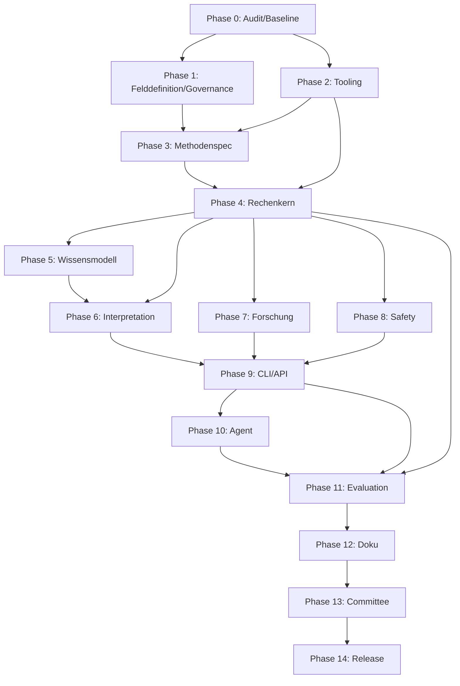

# Implementation Plan — Numerology Analyst Agent

> **Dokumenttyp:** Übersetzungsplan Master-Prompt → ausführbare Schritte
> **Stand:** 2026-07-26 (V1.2 — State Reconciliation nach v0.1.3)
> **Sprache:** Deutsch
> **Status:** Foundation Release 0.1.3 abgeschlossen — Vollständiger Profilkern (0.1.4) ausstehend

Dieses Dokument übersetzt den Master-Prompt in einen ausführbaren Plan.
**Nicht** die Roadmap (Phasen liegen in `ROADMAP.md`) — sondern die
**Übersetzung**: welche Milestone-Reihenfolge, welche Delegationsstrategie,
welcher Git-Workflow, welcher kritische Pfad, welche Risiken, welche
Akzeptanzkriterien.

---

## 1. Recommended Milestone-Reihenfolge

Sechs Releases, streng sequenziell. Kein automatischer Übergang — jeder
Release braucht **menschliche Freigabe** durch Luke (Principal).

```mermaid
graph LR
    M13[M0: Release 0.1.3 Contract Integrity<br/>✅ LIVE]
    M14[M1: Release 0.1.4 Complete Core Profile<br/>Namenszahlen + Segmentierung]
    M15[M2: Release 0.1.5 Deterministic Cycles<br/>Pinnacles + Challenges]
    M2[M3: Release 0.2.0 Knowledge + Interpretation<br/>Phasen 5-6]
    M3[M4: Release 0.3.0 Interfaces + Agent<br/>Phasen 8-10]
    M4[M5: Release 0.4.0 Research Preview<br/>Phase 7]

    M13 -->|abgeschlossen| M14
    M14 -->|Milestone-Review 0.1.4| M15
    M15 -->|Milestone-Review 0.1.5| M2
    M2 -->|Milestone-Review 0.2.0| M3
    M3 -->|Milestone-Review 0.3.0| M4
    M4 -->|Milestone-Review 0.4.0| RELEASE[Vollstaendige Plattform V1]
```



> **Hinweis (V1.2):** Phasen 11–14 (Evaluation, Doku, Committee, Release) werden IN die jeweiligen Releases eingebettet, nicht als separate Meilensteine geführt. Milestone-Reviews sind zusätzlich zu den normalen PR-Reviews.

Release 0.1.3 (Phasen 0–4, reduziert) — Contract Integrity, ✅ LIVE.
Release 0.1.4 (Phase 4, erweitert) — Complete Core Profile, ⏳ als nächstes.

### Warum diese Reihenfolge

- **0.1.3 vor 0.1.4:** Life-Path-Kern + Tooling + CI + Branch Protection mussten zuerst stehen.
- **0.1.4 vor 0.1.5:** Namenszahlen sind Grundlage für Zyklen (Reifezahl).
- **0.1.5 vor 0.2.0:** Zyklen sind Teil des vollständigen Profils, das die Interpretation braucht.
- **0.2.0 vor 0.3.0:** Ohne Wissensmodell und Interpretation keine sinnvolle API.
- **0.3.0 vor 0.4.0:** Ohne fertige Features keine vollständige Testmatrix.
- **0.4.0 = Research Preview:** Hypothesen prüfbar machen, nicht bestätigen.

---

## Dependency Graph (V1.1)

Die folgenden Abhängigkeiten definieren, was parallel laufen kann und was den kritischen Pfad blockiert. Parallele Arbeit ist erlaubt, wenn keine direkte Daten-, Schema- oder Codeabhängigkeit besteht — maximal 3 aktive Streams gleichzeitig (§2), gemeinsames Integrationsgate (CI + Milestone-Review).



**Kritischer Pfad für Release 0.1.0:** Phase 0 → 1 → 2 → 3 → 4.

**Parallele Opportunities (V1.1):**
- Phase 7 (Forschung) kann **parallel zu Phase 5/6** laufen, sobald Phase 4 steht (keine Codeabhängigkeit zur Interpretation).
- Phase 8 (Safety) kann **parallel zu Phase 6/7** laufen (abhängt nur von Phase 4).
- Phase 5 (Wissensmodell) kann **parallel zu Teilen von Phase 6** vorbereitet werden, fällt aber in Release 0.2.0.

**Phase 9 (CLI/API) ist entkoppelt (V1.1):**
- **Core CLI/API** (`/v1/calculate/*`, `/v1/interpret/*`) abhängig von: Phase 4 + Basis-Schemas + Phase 8.
- **Research-Endpunkt** (`/v1/research/smoke`) separat abhängig von: Phase 7.
- Grund: `POST /v1/calculate/profile` benötigt keinen Forschungsrahmen.

---

## 2. Pro-Milestone-Plan

### M1 — Fundament (Phasen 0, 1, 2, 3)

**Aufwand:** ca. 13–20 Tage.

| Phase | Titel | Aufwand | Gate |
|-------|-------|---------|------|
| 0 | Audit & Baseline | S | Dateibestand verifiziert, Baseline dokumentiert |
| 1 | Felddefinition & Governance | M | Claim-Taxonomie scharf, ADR-System steht |
| 2 | Tooling-Fundament | L | 5 Pflichtbefehle grün (uv, ruff, mypy, pytest, mkdocs) |
| 3 | Methodenspec pythagorean-v1 | L | Pseudocode+Vertrag+Tests für jeden Algorithmus |

**Review-Punkt M1:**

- Spec für `pythagorean-v1` steht (Phase 3 Gate).
- Toolchain reproduzierbar (Phase 2 Gate).
- 5 Pflichtbefehle in frischem Checkout grün.
- **OFFEN-Punkte 1–5 (Y, Umlaute, Akzente, Mehrfachnamen, Geburtsname) GELÖST.**
- Claim-Taxonomie schärft die 6 Aussageklassen (Phase 1 Gate).

**Akzeptanzkriterien M1 (konservativ, nachweisbar):**

1. `git checkout main && git pull` → `uv sync --all-groups` läuft ohne Fehler.
2. `uv run ruff format --check . && uv run ruff check .` → grün.
3. `uv run mypy src tests scripts` → grün (strict).
4. `uv run pytest` → grün (echte Tests für implementierten Scope, keine Platzhalter-Tests).
5. `uv run mkdocs build --strict` → grün.
6. `docs/methods/pythagorean-v1.md` existiert mit Pseudocode für alle
   Kernberechnungen.
7. Alle OFFEN-Punkte 1–5 sind als Entscheidung in `docs/methods/` dokumentiert.
8. `docs/field/claim-taxonomy.md` definiert 6 Aussageklassen mit Beispielen.

**Delegationsstrategie M1:**

Siehe „Phasen-Map (V1.1)" in §4 für die echten Agent-Verträge. Für M1 (Release 0.1.0, Phasen 0–4) sind zuständig: `domain-architect` (Phase 1, 3), `release-engineer` (Phase 0, 2), `calculation-engineer` (Phase 4). Parallele Logik: max. 3 Streams nach §2.

---

### M2 — Rechenkern & Wissen (Phasen 4, 5, 6)

**Aufwand:** ca. 12–15 Tage.

| Phase | Titel | Aufwand | Gate |
|-------|-------|---------|------|
| 4 | Deterministischer Rechenkern | XL | Core-Coverage ≥ 95 %, byte-stabil |
| 5 | Wissensmodell & Content Packs | L | Alle YAML schema-validiert |
| 6 | Interpretation & Analysemodell | L | Jede Aussage rückverfolgbar |

**Review-Punkt M2:**

- Rechenkern ist **byte-stabil** für identische Eingabe+Policy.
- Coverage ≥ 95 % für `numerology_engine`.
- Wissenspakete schema-validiert; KI-Autorschaft in Manifest markiert.
- Interpretationen verweisen auf calc-facts und knowledge-entries.

**Akzeptanzkriterien M2:**

1. `uv run pytest --cov=src/numerology_engine --cov-fail-under=95` → grün.
2. **Determinismus-Test:** gleiche Eingabe zweimal ausgeführt → identische
   strukturierte JSON-Ausgabe (byteweise).
3. **No-Network-Test:** `monkeypatch socket` blockiert; Tests bleiben grün.
4. `uv run python scripts/validate_knowledge.py` → grün.
5. `uv run python scripts/validate_schemas.py` → grün.
6. `knowledge/manifest.yaml` enthält `generated: true`, Model, Datum für alle
   KI-generierten Einträge (Default #4).
7. Interpretationstexte enthalten **keine** diagnostischen Begriffe (Blacklist-Check).

**Delegationsstrategie M2:**

Siehe „Phasen-Map (V1.1)" in §4. Für M2 (Release 0.2.0, Phasen 5–6) sind zuständig: `knowledge-editor` (Phase 5), `domain-architect` + `knowledge-editor` (Phase 6).

---

### M3 — Forschung, Safety, App (Phasen 7, 8, 9, 10)

**Aufwand:** ca. 15–19 Tage.

| Phase | Titel | Aufwand | Gate |
|-------|-------|---------|------|
| 7 | Forschungsrahmen | L | Smoke-Run offline reproduzierbar |
| 8 | Safety, Ethik, Datenschutz | L | Secret-Scan grün, PII-Tests, Krisen-Interrupt |
| 9 | CLI, API, Berichte | L | API/CLI-Tests grün, OpenAPI deterministisch |
| 10 | Agentenschicht | M | Plattform ohne LLM nutzbar, Mock-Only in V1 |

**Review-Punkt M3:**

- Research-Smoke reproduzierbar offline mit synthetischen Daten (Default #3).
- Safety-Tests decken PII, Krisen, Minderjährige ab.
- CLI-Smoke mit Golden Case grün.
- API-Integrationstests grün, OpenAPI reproduzierbar.
- Agent läuft nur mit Mock-Provider (Default #5).

**Akzeptanzkriterien M3:**

1. `uv run python scripts/research_smoke.py` → grün, offline, deterministischer Seed.
2. `uv run pytest tests/safety/` → grün, alle PII/Krise/Minderjährigen-Fälle.
3. `apps/cli/main.py` existiert, `numerology calculate profile` funktioniert
   mit Golden Case.
4. `apps/api/main.py` startet, `GET /health` → 200.
5. `uv run python scripts/generate_openapi.py` → reproduzierbares Schema
   (byteweise stabil bei zwei Aufrufen).
6. `numerology_agent` importiert ohne echten Provider, Mock-Provider testbar.

**Delegationsstrategie M3:**

Siehe „Phasen-Map (V1.1)" in §4. Für M3 (Release 0.3.0, Phasen 8–10) sind zuständig: `safety-reviewer` (Phase 8), `release-engineer` (Phase 9), `safety-reviewer` + `release-engineer` (Phase 10).

> Hinweis: Die ursprüngliche Planung hatte M3 = Phasen 7–10. In V1.1 ist Phase 7 (Forschung) in M4 (Release 0.4.0 Research Preview) verschoben.

---

### M4 — Evaluation & Release (Phasen 11, 12, 13, 14)

**Aufwand:** ca. 11–14 Tage.

| Phase | Titel | Aufwand | Gate |
|-------|-------|---------|------|
| 11 | Evaluation & Qualitätsgates | L | Coverage 95/85, alle Tests grün |
| 12 | Doku & Beispiele | M | Quickstart 1:1 mit Realität |
| 13 | Committee Review | M | 5 Perspektiven, Findings gelöst |
| 14 | GitHub-Finalisierung & Release | M | Tag 0.1.0, GitHub Release |

**Review-Punkt M4:**

- Gesamtabdeckung ≥ 85 %, Core ≥ 95 %.
- Mypy strict, Ruff, Docs strict, Schema, Security, Research-Smoke — alle grün.
- Quickstart in frischem Checkout funktioniert (1–5 aus Master-Prompt §7 Phase 12).
- Committee-Freigabe (`release-decision.md` mit klarer If/Then-Logik).
- GitHub Release `0.1.0` mit Notes.

**Akzeptanzkriterien M4:**

1. `uv run pytest --cov=src --cov-fail-under=85` → grün.
2. `uv run mypy src apps` → strict, grün.
3. `uv run mkdocs build --strict` → grün.
4. `uv build` → Wheel + Sdist erfolgreich.
5. `git status --short` → clean.
6. `git diff --check` → clean.
7. `docs/committee/release-decision.md` → klare Freigabe mit Gründen.
8. GitHub Tag `v0.1.0` existiert, GitHub Release mit Notes existiert.
9. Branch Protection dokumentiert in `docs/`.

**Delegationsstrategie M4:**

Siehe „Phasen-Map (V1.1)" in §4. Für M4 (Release 0.4.0 Research Preview) ist zuständig: `research-reviewer` (Phase 7 — synthetische Datensätze, Nullmodelle, Permutationstests). Phase 11–14 (Evaluation, Doku, Committee, Release) werden in die jeweiligen Releases eingebettet (`release-engineer` + menschliches Committee).

> Hinweis: In V1.1 sind die ehemals separaten M4-Phasen 11–14 (Evaluation/Doku/Committee/Release) in die Releases 0.1.0–0.4.0 eingebettet, kein separater Meilenstein mehr.

---

## 3. Kritische Pfadanalyse

### Der kritische Pfad

```
P0 → P1 → P3 → P4 → P6 → P9 → P11 → P12 → P13 → P14
```

**Länge des kritischen Pfads:** ~50–60 Tage.

### Warum Phase 4 (Rechenkern) der Flaschenhals ist

| Phase | Blockiert | Konsequenz bei Verzögerung |
|-------|-----------|----------------------------|
| 4 | 5, 6, 7, 8, 9, 10, 11 | Kompletter Folgeplan ruht |
| 4 | Coverage 95 % ist hardest gate | Kein Test-Skip erlaubt |
| 4 | Byte-Stabilität vererbt sich | Bricht hier → bricht in 9, 11 |

**Empfehlung:** Phase 4 bekommt die meiste Aufmerksamkeit. Nach V1.1 ist
`calculation-engineer` (lt. `.github/agents/`) der führende Vertrag für den
Rechenkern; parallele Sub-Wellen (Engine, Tests, Determinismus-Check) max. 3
parallel (§2). Siehe „Phasen-Map (V1.1)" in §4.

### Abhängigkeits-Engpässe

1. **Phase 5 braucht Phase 3 + Phase 4.** Wissensmodell kann nicht ohne
   Methodenversion + Rechenkern-Trennung gebaut werden.
2. **Phase 9 braucht Phase 4 + 6 + 7 + 8.** API benötigt fertigen Engine +
   Interpretation + Forschung + Safety.
3. **Phase 11 braucht Phase 4 + 9 + 10.** Evaluation benötigt alle stabilen
   Module.

### Parallele Opportunities

Siehe „Dependency Graph (V1.1)" oben für die matrix-förmigen Parallelisierungsregeln.

---

## 4. Delegationsstrategie (Gesamt)

### Prinzipien (nach CLAUDE.md §2)

- **Max. 3 Subagenten parallel.**
- **Ein Subagent = eine Aufgabe.**
- Subagent-Prompt = Kontext + Ziel + Constraints + Output-Format.
- Subagent-Output **immer validieren**.
- Context7-Schritt bei Framework-Code verpflichtend (FastAPI, Typer, Pydantic v2).

### Phasen-Map (V1.1 — echte Agent-Verträge aus `.github/agents/`)

| Phase | Agent (lt. `.github/agents/`) |
|-------|-------------------------------|
| 0 | (Audit/Baseline — i.d.R. menschlich oder `release-engineer`) |
| 1 (Felddefinition/Governance) | `domain-architect` |
| 2 (Tooling) | `release-engineer` |
| 3 (Methodenspec) | `domain-architect` |
| 4 (Rechenkern) | `calculation-engineer` |
| 5 (Wissensmodell) | `knowledge-editor` |
| 6 (Interpretation) | `domain-architect` + `knowledge-editor` |
| 7 (Forschung) | `research-reviewer` |
| 8 (Safety) | `safety-reviewer` |
| 9 (CLI/API) | `release-engineer` |
| 10 (Agent) | `safety-reviewer` (Claims-Validator) + `release-engineer` |
| 11–14 (Evaluation/Doku/Committee/Release) | `release-engineer` + menschliches Committee |

**Parallele Logik:** Max. 3 aktive Streams gleichzeitig nach CLAUDE.md §2. Die obigen Agent-Zuweisungen definieren den fachlich zuständigen Vertrag; ob mehrere Phasen parallel laufen, hängt von der Dependency Graph ab. Gemeinsames Integrationsgate: CI + Milestone-Review.

**Hinweis zu CLAUDE.md-Querverweisen:** CLAUDE.md §2 nennt generische Rollenbezeichnungen (`godlike-code-master`, `qa-tester` etc.). Diese sind als **Fähigkeits-Profile** zu verstehen, nicht als konkrete Dateinamen. Die konkreten, im Repository hinterlegten Verträge liegen in `.github/agents/` (sechs Agent-Verträge: `domain-architect`, `calculation-engineer`, `knowledge-editor`, `research-reviewer`, `safety-reviewer`, `release-engineer`). Bei fachlich speziellen Aufgaben ist der spezifische Vertrag zu verwenden; `godlike-code-master` bleibt als Fallback für komplexe Code-Aufgaben ohne passenden Spezialagent.

### Context7-Pflicht

Bei Framework-spezifischen Phasen (Phase 2 mit uv/ruff/mypy, Phase 4 mit
pydantic v2/hypothesis, Phase 9 mit FastAPI/Typer, Phase 7 mit DuckDB/Polars)
müssen Subagenten-Prompts Context7-Schritt enthalten:

1. `resolve-library-id` → korrekte ID.
2. `get-library-docs` → aktuelle Doku + Beispiele (`mode="code"`).
3. Erst dann implementieren.

**Kein Fallback.** Wenn Context7 nicht verfügbar → Task abbrechen, User informieren.

---

## Branch- und PR-Modell (V1.1, nach Lukes Review)

**Grundprinzip:** Branch pro Issue oder vertikalem Slice — nicht pro theoretischer Phase. Phasen können über mehrere Branches/PRs verteilt sein; ein Branch kann Teile mehrerer Phasen enthalten, wenn sie logisch zusammengehören.

**Regeln:**

1. **Branch-Naming:** `<type>/<ticket>-<scope>` (z.B. `feat/0.1.0-life-path`, `docs/governance-master-contract`).
2. **Mehrere atomare Commits erlaubt** — nicht „1 Commit pro Phase". Jeder Commit ist für sich sinnvoll und testbar.
3. **Draft-PR früh öffnen** — sobald erste Teilergebnisse stehen, PR als Draft.
4. **Required Checks pro PR** — CI muss grün sein vor Merge (`uv run ruff format --check .`, `uv run ruff check .`, `uv run mypy src apps`, `uv run pytest`, ab Phase 2: `uv run mkdocs build --strict`).
5. **Squash-Merge nach Review** — keeps `main`-Historie linear.
6. **Milestone-Review zusätzlich** — am Ende jedes Releases (0.1.0, 0.2.0, 0.3.0, 0.4.0) erfolgt ein formelles Milestone-Review. Milestone-Review ersetzt NICHT die normalen PRs, sondern kommt zusätzlich.
7. **Verboten:** Direkt-Push auf `main`, Force-Push, `--no-verify` (Hook-Fehler werden behoben, nicht umgangen).

**Commit-Sprache:** Commit-Messages aus dem Master-Vertrag (`docs/governance/master-implementation-contract.md` §7) sind **englisch** und werden als Vorgabe übernommen. Eigene Commits außerhalb der Phasen-Vorgaben folgen CLAUDE.md §7 (deutsch): Format `<type>: <kurzbeschreibung>`, Fokus auf Warum.

---

## 6. 10 aktivste Risiken mit Mitigation

| # | Risiko | Wahrscheinlichkeit | Impact | Mitigation |
|---|--------|-------------------|--------|------------|
| 1 | Phase 4 (Rechenkern) wird teurer als XL (10–15 Tage) | Hoch | Sehr hoch | Schon in M1 strikte Spec; hypothesis-Tests früh; Subagenten parallel |
| 2 | OFFEN-Punkte 1–5 (Y, Umlaute, Akzente, Namen, Geburtsname) ungelöst | Hoch | Hoch | Als M1-Akzeptanzkriterium; Luke muss entscheiden |
| 3 | Byte-Stabilität bricht (Dikt-Reihenfolge, Floats, Hash) | Mittel | Hoch | Pydantic v2 mit sortierten Keys; deterministischer Hash in Phase 4 |
| 4 | Coverage 95 % nicht erreicht | Mittel | Hoch | Coverage-Tracking ab Phase 4; Property-Tests für Invarianten |
| 5 | KI-generiertes Wissen als Wahrheit verkauft | Mittel | Hoch | Manifest mit `generated: true` (Default #4); Validator prüft Markierung |
| 6 | PII-Leak in synthetischen Daten oder Biografien | Niedrig | Sehr hoch | PII-Scanner pre-commit; Default #3 (nur synthetisch in V1) |
| 7 | Diagnose-Sprache in Interpretationen | Mittel | Hoch | Blacklist-Validator in Phase 6; Claims-Validator in Phase 8 |
| 8 | Hallucination der Vorgängersession wiederholt sich | Hoch | Mittel | Verifikation mit `dir`+`git log` vor jeder "fertig"-Aussage |
| 9 | Stille Defaults in API/CLI verletzen §6.2 | Mittel | Mittel | Policy-Feld Pflicht; kanonische Default-Config dokumentiert |
| 10 | OpenAPI nicht deterministisch | Mittel | Mittel | Pydantic v2 sortierte Felder; Reproduzierbarkeits-Test in Phase 9 |

### Risiken, die der Master-Prompt nicht abdeckt (OFFEN)

- **OFFEN-9:** Sample-Größe für Phase 7 (synthetische Daten) — Default #3
  nennt nur "synthetisch", nicht die Größe. → Phase 7 muss definieren.
- **OFFEN-10:** Welches KI-Modell für Knowledge-Pack-Drafts (Default #4)? →
  Phase 5 muss im Manifest vermerken.
- **OFFEN-11:** Committee-Reviewer in Phase 13 — wer sind die echten Reviewer?
  Falls nur KI-Subagenten, besteht Self-Review-Bias-Risiko.

---

## 7. Akzeptanzkriterien pro Milestone (Zusammenfassung)

### M1 (konservativ)

- 5 Pflichtbefehle in frischem Checkout grün.
- `docs/methods/pythagorean-v1.md` mit Pseudocode für alle Kernberechnungen.
- OFFEN-Punkte 1–5 entschieden und dokumentiert.
- Claim-Taxonomie scharf mit 6 Aussageklassen.

### M2 (konservativ)

- Coverage `numerology_engine` ≥ 95 %.
- Determinismus-Test grün (byteweise identisch).
- Wissenspakete schema-validiert, KI-Autorschaft markiert.
- Keine Diagnose-Sprache in Interpretationen.

### M3 (konservativ)

- Research-Smoke offline reproduzierbar.
- Safety-Tests für PII/Krise/Minderjährige grün.
- CLI-Smoke mit Golden Case grün.
- OpenAPI deterministisch.
- Mock-Only-Agent (kein echter Provider).

### M4 (konservativ)

- Gesamtabdeckung ≥ 85 %.
- Mypy strict, Ruff, Docs strict, Schema, Security, Research-Smoke — alle grün.
- Quickstart in frischem Checkout funktioniert (1–5 aus Master-Prompt).
- Committee-Freigabe (`release-decision.md`).
- GitHub Release `0.1.0` mit Notes.

---

## 8. Definition of Done — Endkontrolle

Vorbehaltlich Master-Prompt §9 + §8 (Pflichtvalidierung):

1. `uv sync --all-groups` → grün.
2. `uv run ruff format --check . && uv run ruff check .` → grün.
3. `uv run mypy src apps` → strict, grün.
4. `uv run pytest --cov=src --cov-report=term-missing --cov-fail-under=85` → grün.
5. `uv run python scripts/validate_schemas.py` → grün.
6. `uv run python scripts/validate_knowledge.py` → grün.
7. `uv run python scripts/generate_examples.py` → grün, reproduzierbar.
8. `uv run python scripts/research_smoke.py` → grün, offline.
9. `uv run mkdocs build --strict` → grün.
10. `uv build` → Wheel + Sdist erfolgreich.
11. `git status --short` → clean.
12. `git diff --check` → clean.
13. API lokal gestartet, `GET /health` → 200.
14. CLI mit Golden Case → grün.
15. Frischer Installations-Smoke in sauberer Umgebung → grün.
16. Keine Secrets, Rohdaten oder lokalen Pfade committed.
17. Tag `v0.1.0` + GitHub Release mit Notes.

**Jede Erfolgsbehauptung benötigt technischen Nachweis** — keine pauschale
"alles fertig"-Aussage (Master-Prompt §10).

---

## 9. Querverweise

| Siehe | Für |
|-------|-----|
| `PROJECT_CHARTER.md` | Mission, V1-Scope, Aussageklassen |
| `ROADMAP.md` | Phasen-Einzelheiten, Aufwand, Delegation pro Phase |
| `docs/audit/gap-analysis.md` | Lücken Ist/Soll, P0-Blocker |
| `.planning/notes/master-plan-defaults.md` | Autonome Defaults, revidierbar |
| Master-Prompt §7, §8, §9, §10 | Phasen, Pflichtvalidierung, DoD, Abschlussbericht |

---

*End of Implementation Plan — Numerology Analyst Agent V1*
