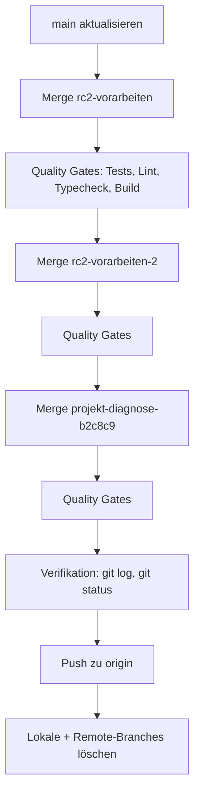

# Merge-Plan: Claude-Branches in `main`

**Datum:** 2026-08-04
**Ziel:** Alle Claude-Branches vollständig in `main` mergen und aufräumen.

## ✅ ERGEBNIS (abgeschlossen)

**Alle 3 Claude-Branches waren inhaltlich bereits vollständig in `main` integriert** – über die Squash-Merges PR #54 (Projektdiagnose) und PR #55 (RC2-Vorarbeiten). Es war kein weiterer Merge nötig.

| Branch | Status | Aktion |
|--------|--------|--------|
| `claude/rc2-vorarbeiten` | Inhalt identisch mit main (two-dot Diff leer) | Lokal + Remote gelöscht |
| `claude/rc2-vorarbeiten-2` | Zeigte exakt auf main HEAD `9435071` | Lokal gelöscht (kein Remote) |
| `claude/projekt-diagnose-b2c8c9` | Diagnose-Dateien identisch in main (PR #54) | Lokal + Remote gelöscht |

**Verifikation:**
- `git cherry main <branch>` → alle Commits als Patch-Äquivalente in main enthalten
- `git diff main <branch> --stat` → `rc2-vorarbeiten`: leer; `projekt-diagnose`: nur RC2-Dateien, die main via PR #55 hat
- `git branch -a` → nur noch `main` (lokal + `origin/main`)
- `git worktree list` → nur noch Haupt-Worktree
- `git status` → sauber (nur untracked Plan-Dateien)

**Hinweis:** Das physische Worktree-Verzeichnis `.claude/worktrees/projekt-diagnose-b2c8c9` konnte wegen eines Windows-Pfadlimit-Fehlers nicht gelöscht werden, ist aber aus Git deregistriert und kann manuell entfernt werden.

## Gefundene Branches

| Branch | Lokal | Remote | Status |
|--------|-------|--------|--------|
| `claude/rc2-vorarbeiten` | ✅ | ✅ | Zu mergen |
| `claude/rc2-vorarbeiten-2` | ✅ (aktuell ausgecheckt) | ❌ | Zu mergen |
| `claude/projekt-diagnose-b2c8c9` | ✅ | ✅ | Zu mergen |

## Merge-Strategie

- **Zielbranch:** `main` (aktuell ausgecheckt)
- **Merge-Methode:** `--no-ff` (Merge-Commit, Historie bleibt nachvollziehbar)
- **Reihenfolge:** `rc2-vorarbeiten` → `rc2-vorarbeiten-2` → `projekt-diagnose-b2c8c9`
  - Begründung: `rc2-vorarbeiten-2` baut vermutlich auf `rc2-vorarbeiten` auf (Namensgebung). `projekt-diagnose` ist ein eigenständiger Dokumentations-Branch und wird zuletzt gemerged.

## Ablauf

## Schritte

1. **Analyse**
   - `git status` (Working Tree sauber?)
   - `git fetch --all --prune`
   - `git log --oneline` für alle Branches
   - `git diff main...<branch> --stat` für jeden Branch (Änderungsumfang)
   - `git merge-base` prüfen (Divergenz)

2. **main aktualisieren**
   - `git checkout main`
   - `git pull origin main`

3. **Merge 1: `claude/rc2-vorarbeiten`**
   - `git merge --no-ff claude/rc2-vorarbeiten`
   - Bei Konflikten: lösen, `git add`, `git commit`

4. **Quality Gates nach Merge 1**
   - Tests, Lint, Typecheck, Build (laut `package.json` / `Makefile`)

5. **Merge 2: `claude/rc2-vorarbeiten-2`**
   - `git merge --no-ff claude/rc2-vorarbeiten-2`
   - Bei Konflikten: lösen, `git add`, `git commit`

6. **Quality Gates nach Merge 2**

7. **Merge 3: `claude/projekt-diagnose-b2c8c9`**
   - `git merge --no-ff claude/projekt-diagnose-b2c8c9`
   - Bei Konflikten: lösen, `git add`, `git commit`

8. **Quality Gates nach Merge 3**

9. **Verifikation**
   - `git log --oneline --graph -15`
   - `git status` (sauber)
   - Finaler Testlauf

10. **Push & Aufräumen**
    - `git push origin main`
    - Lokale Branches löschen: `git branch -d claude/rc2-vorarbeiten claude/rc2-vorarbeiten-2 claude/projekt-diagnose-b2c8c9`
    - Remote-Branches löschen: `git push origin --delete claude/rc2-vorarbeiten claude/projekt-diagnose-b2c8c9`
    - **Hinweis:** Remote-Löschung nur mit Bestätigung des Users

11. **Dokumentation**
    - Merge-Ergebnis in `docs/` festhalten

## Risiken & Absicherung

- **Konflikte:** Bei Konflikten wird der Merge abgebrochen (`git merge --abort`), analysiert und kontrolliert gelöst.
- **Rollback:** Vor jedem Merge wird der aktuelle `main`-Stand notiert (SHA), damit ein `git reset --hard` möglich ist.
- **Quality Gates:** Nach jedem Merge müssen alle Checks grün sein, bevor der nächste Merge erfolgt.
- **Uncommitted Changes:** Falls der Working Tree nicht sauber ist, wird vor dem Merge gestasht oder committet.
