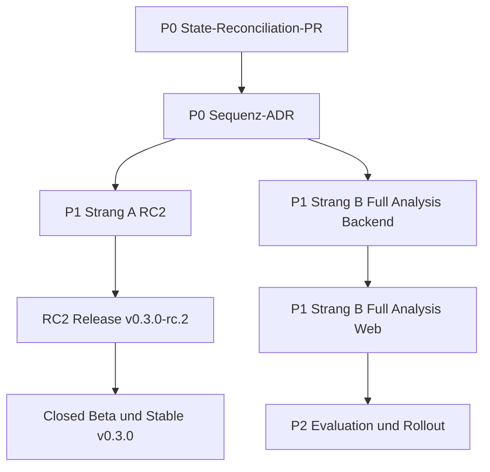

# Numra — Umsetzungsplan nach Gesamtaudit (2026-08-04)

> **Zweck:** Verbindlicher Umsetzungsplan, der die Befunde des Gesamtaudits
> (Projekt-Chats gegen GitHub-Repository) in ausführbare Arbeit überführt.
> **Prinzip:** Repository-Truth zuerst (P0), dann Sequenz-Governance (P0),
> dann RC2 (P1) und Full Analysis (P1/P2) in getrennten Strängen.
> **Keine Zeitangaben** — nur klare, abhängigkeitsgeordnete Arbeitsschritte.

---

## 1. Verifizierter Ist-Zustand (Basis für alle Schritte)

Die Audit-Befunde wurden direkt im Repository verifiziert:

| Befund | Verifiziert | Beleg |
|---|---|---|
| `ROADMAP.md` fehlt im Workspace-Root, Worktree-Stand veraltet (SHA `5976ae2`, „0/0 offene PRs/Issues“) | ✅ | `.claude/worktrees/projekt-diagnose-b2c8c9/ROADMAP.md:12` |
| GHSA-ID `GHSA-qwww-vcr4-c8h2` doppelt in `package.json` (`ignoreGhsas` **und** `ignoreCves`) | ✅ | `package.json:21-27` |
| `pyproject.toml`-Kommentare „Walking Skeleton“ / „No network/HTTP/LLM deps“ bei vollem Produktstack | ✅ | `pyproject.toml:11-12` |
| README behauptet Restore/Rollback „noch nicht real ausgeführt“ | ✅ | `README.md:48-50` |
| Lokaler Restore-/Rollback-Nachweis existiert bereits (PASS) | ✅ | `docs/operations/rollback-rehearsal-local-2026-08-04.md:1` |
| Fortschrittsplan nennt PR #55 „offen, CI läuft“ | ✅ | `.claude/plans/dapper-fluttering-kazoo.md:23` |
| `unreleased-numra.md` / `current-state-numra-post-rc1` auf Stand 2026-08-02, Restore/Rollback `NOT_EXECUTED` | ✅ | `docs/releases/unreleased-numra.md:3`, `docs/audit/current-state-numra-post-rc1-2026-08-02.md:3` |
| V2-Rechenkern implementiert (`calculate_profile_v2`, `ProfileCalculationResultV4`) | ✅ | `src/numerology_engine/profile_v2.py:505` |
| API V1-only mit 422-Guard, keine V2-Route | ✅ | `src/numerology_api/routes/profiles.py:53` |
| CLI V1-only, kein `--method-version` | ✅ | `src/numerology_cli/main.py:97` |
| CI vollständig (Quality Gates, Package Smoke, Web, Container, LLM-Staging-Override) | ✅ | `.github/workflows/ci.yml:13` |
| ADR 0016 führt V2 als `DEFERRED` | ✅ | `docs/adr/0016-v2-user-owned-masterplan-boundary.md:1` |

---

## 2. Architektur der Umsetzung



**Drei getrennte Programme (Sequenz-ADR):**

| Programm | Inhalt | Status |
|---|---|---|
| **A — RC2 Release Readiness** | Staging-Host, Deploy-by-Digest, Restore/Rollback auf Host, Committee-Re-Review, RC2-Schnitt | primärer Releasepfad |
| **B — pythagorean-v2 + Full Analysis** | `/api/v2`, V3-Wissen, V3-Agent, 18-Kapitel-Bericht, Tab-UI | parallel, nur unter `/api/v2`, hinter Feature Flag, kein Default-Wechsel |
| **C — Guided Masterplan** | nutzergeführtes Produktprogramm | gesperrt bis nach Stable `v0.3.0` |

---

## 3. P0 — Repository-Truth wiederherstellen (ein PR)

**Ziel:** Widersprüchliche Zustände beseitigen, bevor neuer Produktivcode beginnt.
**Umfang:** Nur Dokumentation + 2 Konfigurations-Fixes. CI muss vollständig grün laufen.

### 3.1 `ROADMAP.md` wiederherstellen und aktualisieren

- Datei aus dem Worktree (`.claude/worktrees/projekt-diagnose-b2c8c9/ROADMAP.md`) in den
  Workspace-Root übernehmen.
- Steuerungsstand aktualisieren:
  - `origin/main` → `a3f168ef99823fa2fd1c3f3b6536ea7523def451`
  - Offene PRs/Issues: PR #55 **gemergt**; offene Issues #39–#49, Epic #37
  - OPS-001 (Restore-Skript) → **behoben** (PR #55)
  - OPS-002 (Deploy-by-Digest) → **behoben** (PR #55)
  - OPS-003 (GHSA-Zuordnung) → **behoben** (dieser PR, siehe 3.4)
  - Lokaler Restore-Test → **PASS**; lokaler Rollback-Rehearsal → **PASS**
  - Privates Host-Staging → **NOT_EXECUTED** (einziger verbleibender Blocker)
  - Committee Review → **COMPLETE**; Release Decision → **NO_GO**;
    Operational Acceptance → **BLOCKED_BY_STAGING**
- Governance-Widerspruch auflösen: V2-Programm nicht mehr ausschließlich „nach Stable“,
  sondern gemäß neuem Sequenz-ADR (siehe Abschnitt 4) als paralleler Strang B führen.

### 3.2 `README.md` präzisieren

- Abschnitt „LLM-Staging“ (Zeile 47-50) korrigieren:
  - Lokaler Restore-Test: **PASS** (`docs/operations/rollback-rehearsal-local-2026-08-04.md`)
  - Lokaler Rollback-Rehearsal: **PASS**
  - Privates Host-Staging-Restore: **NOT_EXECUTED**
  - Privates Host-Staging-Rollback: **NOT_EXECUTED**
- Versionshinweis (Zeile 330-333): `pyproject.toml` steht auf `0.3.0rc1` (nicht mehr `0.1.5`).

### 3.3 `.claude/plans/dapper-fluttering-kazoo.md` korrigieren

- PR #55: „offen, CI läuft“ → **gemergt**
- OPS-001, OPS-002: offene Befunde → **abgeschlossen** (Fortschrittstabelle und Befundtabelle konsistent)
- A3 (frischer Gate-Lauf + RC2-Kandidat): → **abgeschlossen**
- A0 (Staging-Host): bleibt einziger offener Blocker für A4–A6
- Strang B: B0-Sequenz-ADR → **wird in diesem Plan geschrieben** (Abschnitt 4)

### 3.4 `package.json` — GHSA-Zuordnung korrigieren

- `GHSA-qwww-vcr4-c8h2` aus `auditConfig.ignoreCves` **entfernen**.
- Nur in `auditConfig.ignoreGhsas` belassen (korrekte Zuordnung unter pnpm 10).
- CI-Audit-Befehl (`pnpm audit --audit-level high --ignore GHSA-qwww-vcr4-c8h2`)
  bleibt unverändert gültig.

### 3.5 `pyproject.toml` — Metadaten und Kommentare aktualisieren

- Projektbeschreibung erweitern: von „deterministic pythagorean profile and cycle
  calculation core“ auf den vollständigen Produktstack (API, CLI, Wissen, Agent, PWA).
- Kommentare „Runtime dependencies for the Walking Skeleton (Life Path A/B only)“ und
  „No network/HTTP/LLM deps“ entfernen bzw. durch korrekte Beschreibung ersetzen
  (FastAPI, HTTPX, Redis sind Teil des Produktstacks).
- **Keine** Versionsänderung (`0.3.0rc1` bleibt bis zum RC2-Schnitt).

### 3.6 Release-/Status-Dokumente aktualisieren

- `docs/releases/unreleased-numra.md`:
  - Aktueller `main` → `a3f168e`
  - PR #55 in die Liste der gemergten PRs aufnehmen
  - Tabelle „Explizit unreleased / blockiert“: lokaler Restore/Rollback → **PASS**,
    Host-Staging → **NOT_EXECUTED**
- `docs/audit/current-state-numra-post-rc1-2026-08-02.md`:
  - Abschnitt 2: lokale Nachweise ergänzen (Restore PASS, Rollback PASS),
    Host-Staging bleibt NOT_EXECUTED
  - Abschnitt 3: Versions-/Release-Pfad um parallelen V2-Strang (Sequenz-ADR) ergänzen

### 3.7 Full-Analysis-Plan kanonisieren

- `.claude/plans/goal-numra-full-ancient-wreath.md` (66 KB, sehr detailliert) nach
  `docs/plans/numra-full-analysis-v2-v3.md` übernehmen (oder als
  `docs/architecture/numra-full-analysis-v2-v3.md`).
- Im Plan-Dokument einen Statuskopf ergänzen: „Architekturplan, kanonisiert am
  2026-08-04; Umsetzung in Wellen 1–3 (Backend) und Welle 4 (Web), siehe Abschnitt 6“.
- Referenzen in `ROADMAP.md` und README auf den neuen kanonischen Pfad umstellen.

### 3.8 Verifikation P0

```bash
uv lock --check && uv sync --locked --all-groups
uv run ruff format --check . && uv run ruff check .
uv run mypy src tests scripts
uv run pytest --cov=src/numerology_engine --cov-fail-under=95
uv run pytest --cov=src --cov-fail-under=85
uv run python scripts/export_schemas.py --check
uv run python scripts/export_openapi.py --check
uv run python scripts/generate_examples.py --check
uv run python scripts/validate_knowledge.py
pnpm audit --audit-level high --ignore GHSA-qwww-vcr4-c8h2
pnpm web:lint && pnpm web:typecheck && pnpm web:coverage && pnpm web:build && pnpm web:check-build
docker compose config --quiet
```

**Abnahme P0:** Ein PR, alle Gates grün, keine Verhaltensänderung an öffentlichen Verträgen.

---

## 4. P0 — Sequenz-ADR schreiben

**Ziel:** Den Governance-Widerspruch zwischen Roadmap/Epic #37 („V2 erst nach Stable“)
und Fortschrittsplan („V2 parallel zu RC2“) verbindlich auflösen.

### Inhalt des ADR

1. **Drei Programme ausdrücklich trennen** (Begriffe nicht mehr vermischen):
   - `pythagorean-v2` = neue deterministische Berechnungsmethode
   - V2/V3 Full Analysis Stack = V2-Profil + V3-Wissen + V3-Agent + neue UI
   - V2 Guided Masterplan = separates nutzergeführtes Produktprogramm
2. **Entscheidung:**
   - Programm A (RC2) bleibt primärer Releasepfad.
   - Programm B (pythagorean-v2 + Full Analysis) darf parallel entwickelt werden,
     aber ausschließlich unter `/api/v2`, hinter Feature Flag, V1 unverändert,
     kein Default-Wechsel, nicht zwingend Bestandteil des RC2-Tags.
   - Programm C (Guided Masterplan) bleibt bis nach Stable `v0.3.0` gesperrt.
3. **ADR 0016** im Geltungsbereich als `SUPERSEDED` kennzeichnen (nicht still editieren).
   Der neue Sequenz-ADR ersetzt die bisherige Sequenzentscheidung.
4. **Verzahnungsregel:** Solange Strang A offen ist, kein V2-Merge nach `main`;
   Welle 4 (Web) erst nach dem RC2-Schnitt mergen.

**Abnahme:** ADR liegt unter `docs/adr/0017-...md`, ADR 0016 als SUPERSEDED markiert,
`ROADMAP.md` referenziert den neuen ADR.

---

## 5. P1 — Strang A: RC2 abschließen

**Abhängigkeit:** A0 (Staging-Host) ist extern und blockiert A4–A6.

| Schritt | Inhalt | Status |
|---|---|---|
| A0 | Staging-Host benennen und freigeben (Docker-fähig, ≥ 40 GiB unter `/opt`, `127.0.0.1:8080`) | **extern offen** |
| A4.1 | Preflight auf dem Host (`deploy/scripts/preflight.sh`) | blockiert durch A0 |
| A4.2 | Known-Good-RC1-Baseline deployen, SHA + Digest erfassen, als `KNOWN_GOOD` markieren | blockiert durch A0 |
| A4.3 | RC2-Kandidat per geprüftem Digest deployen, `NUMRA_LLM_ENABLED=false`, Health-/Profil-Smoke, Log-PII-Prüfung | blockiert durch A0 |
| A4.4 | Backup auf Host erzeugen, Restore auf isoliertes Ziel, strukturelle Prüfung, Re-Smoke | blockiert durch A0 |
| A4.5 | Rollback auf Known-Good-Baseline (per Digest), vollständiger Smoke | blockiert durch A0 |
| A4.6 | Optional: Forward-Deploy des Kandidaten wiederholen | blockiert durch A0 |
| A5 | Committee-Re-Review evidenzbasiert (Closure-Einträge pro Bedingung) | blockiert durch A4 |
| A6 | Version `0.3.0rc2`, Release-PR, CI/CodeQL, Tag `v0.3.0-rc.2`, GitHub-Prerelease | blockiert durch A5 |

**Bis dahin gültiger Status:** `RELEASE_DECISION=NO_GO`, `BLOCKED_BY_STAGING`.

---

## 6. P1 — Strang B: Full Analysis Backend (nach Sequenz-ADR)

### Welle 1 — API-Grundlage

- `POST /api/v2/profiles/calculate` (V4-Profil als direkter Requesttyp, `calculate_profile_v2`)
- `GET /api/v2/meta` (V2-Capability-Matrix)
- V1-Contract-Snapshot mit rekursiver Schema-Closure (Schutz gegen stillen Breaking Change)
- Kombinierte `openapi/numra-api.json` (V1 + V2)
- Feature Flags und Dependency-Wiring
- Request-Größenlimits
- **plus ARCH-003:** `--method-version` in der CLI (V2-Auswahl)

### Welle 2 — Fakten- und Wissensmodell

- `KnowledgeEntryV3`, `KnowledgeBundleV3`, `models_v3.py`, `loader_v3.py`
- `de-v3.json` mit getrennten Kontexten (`life_path_primary`, `life_path_secondary`, …)
- V4-Fact-Package (deterministische Fakten aus `ProfileCalculationResultV4`)
- V3-Interpretationsresolver, fail-closed bei mehrdeutigen Treffern
- **Nicht** still das V2-Wissensmodell wiederverwenden

### Welle 3 — Berichtserzeugung

- `ProviderResultV3` mit `finish_reason` (kontrollierte Behandlung von `stop`,
  `length`, `content_filter`, `tool_calls`, Ressourcenfehlern, unbekannten Werten)
- `DeepSeekProviderV3`, `AgentServiceV3`, `AnalysisDraftV3`, `AnalysisReportV3`
- 18 feste Kapitel mit Claim- und Referenzvalidierung, Längenbudgets
- Getrennte Inhalts- und Konfigurationshashes
- `IdempotencyStoreV3` (Redis-Locks, Zustände `PENDING`/`COMPLETED`/`FAILED`,
  Idempotenzprüfung **vor** Rate-Limit, Konflikterkennung bei Key-Wiederverwendung)
- `POST /api/v2/analyses/report`, `POST /api/v2/analyses/follow-up`

**Gates pro Welle:** Ruff, Mypy strict, Python-Coverage, Schema-Drift, OpenAPI-Drift,
Wheel-Smoke, V1-Contract-Snapshot, Container-Smoke.

---

## 7. P1 — Strang B: Full Analysis Web (nach Backend)

- V4-Presentation-Adapter (`ProfilePresentationModel`)
- 9 feste Benutzerreiter, WAI-ARIA-Tabs, URL-Deep-Links, mobile Navigation
- 18-zu-9-Kapitel-Mapping (`sectionMapping.ts`)
- Berichtshistorie (Dexie-v4-Migration), `reportId`-Bindung für Notizen und Follow-ups
- `PrintView.tsx`, PDF aus derselben Präsentationsschicht
- Reaktive Offline-Zustände, opt-in Methodenauswahl

**Gates:** TypeScript strict, ESLint, Vitest, Coverage, Production Build, Bundle Budget,
Playwright (Chromium/Firefox/WebKit), Mobile Projects, axe, Offline-Reload,
Export-/Import-Roundtrip, Dexie-Migrationstest.

---

## 8. P2 — Evaluation, Beta und Default-Wechsel

Erst nach vollständigem Backend und Web:

1. DeepSeek-Konfiguration gegen die 5 Golden-Profile evaluieren.
2. Trunkierungsrate und `finish_reason` messen.
3. V2 nur opt-in freigeben.
4. Closed Beta (informierte Tester, Geräte-Matrix).
5. Default erst wechseln, wenn: Referenzintegrität 100 %, keine unbekannten Referenzen,
   keine PII-Leaks, keine abgeschnittenen Berichte, Kosten-/Latenzgrenzen erfüllt,
   Rollback nachgewiesen.

---

## 9. Kritische Dateien

| Bereich | Dateien |
|---|---|
| P0 Doku | `ROADMAP.md`, `README.md`, `.claude/plans/dapper-fluttering-kazoo.md`, `docs/releases/unreleased-numra.md`, `docs/audit/current-state-numra-post-rc1-2026-08-02.md` |
| P0 Konfig | `package.json`, `pyproject.toml` |
| P0 Kanonisierung | `docs/plans/numra-full-analysis-v2-v3.md` (neu) |
| P0 Governance | `docs/adr/0017-...md` (neu), `docs/adr/0016-...md` (SUPERSEDED) |
| P1 Strang A | `deploy/scripts/*`, `docs/committee/*`, `docs/operations/*` |
| P1 Strang B | `src/numerology_api/routes/*`, `src/numerology_agent/*_v3.py`, `src/numerology_knowledge/*_v3.py`, `apps/web/src/**` |

---

## 10. Was dieser Plan bewusst nicht enthält

- Closed Beta, Stable `v0.3.0`, öffentlicher Launch (hängen an externen Gates:
  Testpersonen, Domain/DNS, HTTPS, Impressum, Rechtsfreigabe Drittlandtransfer).
- Guided Masterplan-Implementierung (Programm C, gesperrt bis nach Stable).
- Forschungsrahmen und Plattform-Erweiterungen (Phase 7, planmäßig offen).
- Abhängigkeits-Major-Upgrades (redis 8.x, mypy 2.x, TypeScript 7.x) — erst im
  Beta-Fenster vor Stable.
